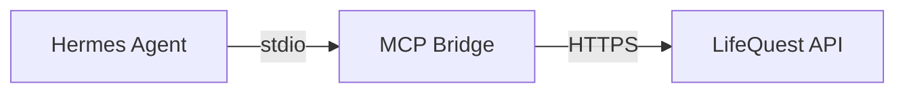

# ⚔️ LifeQuest MCP Bridge

A standalone Model Context Protocol (MCP) server that connects AI agents (like **Hermes**) to your **LifeQuest** (bbits.app) application.

## 🚀 One-Click Install

### Linux / macOS / WSL
```bash
curl -fsSL https://raw.githubusercontent.com/vivibbits/lifequest-mcp/master/installers/install-lifequest-mcp.sh | bash
```

### Windows (PowerShell)
```powershell
irm https://raw.githubusercontent.com/vivibbits/lifequest-mcp/master/installers/Install-LifeQuestMCP.ps1 | iex
```

---

## 🛠️ Manual Installation (Standard Project Way)

If you prefer to clone and install manually:

1. **Clone the repository:**
   ```bash
   git clone https://github.com/vivibbits/lifequest-mcp.git
   cd lifequest-mcp
   ```

2. **Install & Setup:**
   ```bash
   npm install
   npm run setup
   ```

---

## 🏗️ Architecture

The bridge acts as a translator between the AI Agent and the LifeQuest API:



### Environment Variables
If you want to run the bridge manually (e.g., in a Docker container):
- `BBITS_API_URL`: Your LifeQuest instance URL (default: `https://bbits.app`)
- `BBITS_API_KEY`: Your MCP Access Key (generate in Settings -> Connection Portal)

## 📜 License
MIT
